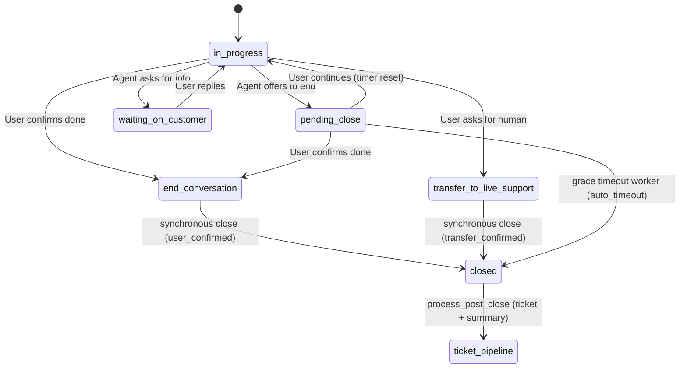

# Session close, grace period, and ticketing

How a chat session is closed (on confirmation or timeout) and how the post-close
summarisation + ticket pipeline runs afterwards.

**Status:** implemented (event-driven). Cron safety-net sweeper is intentionally **not** built yet.
**See also:** [chat-pipeline.md](chat-pipeline.md) · [../api/v1/chat/README.md](../api/v1/chat/README.md) ·
[../workers/README.md](../workers/README.md) · [../pipelines/chat_runtime.md](../pipelines/chat_runtime.md)

---

## Goals

1. Let the agent **offer to end** the chat without immediately closing the session.
2. Give the user time to continue (**grace period**) before auto-closing.
3. **Close immediately** when the user confirms they are done or asks for a human.
4. **Close automatically** if a `pending_close` session times out.
5. **Reject new messages** on closed sessions with a clear "start a new session" error.
6. Run the **summarisation + ticket pipeline** once, after close (event-driven — no daily cron + LLM).

---

## Two layers: conversation state vs session status

Do not confuse orchestrator UX state with DB session lifecycle.

| Layer | Field | Purpose |
|-------|--------|---------|
| UX / orchestrator | `chat_sessions.conversation_state` | What the widget shows; the model sets it each turn |
| Lifecycle | `chat_sessions.status` | `active` vs `closed` |
| Audit | `chat_sessions.closed_at`, `close_reason` | When and why the session ended |

A session is **truly closed** only when `status = closed` and `closed_at` is set.
The server always trusts `status`, never the client's last known `conversation_state`.

| `conversation_state` | Meaning | Closes the session? |
|------------------------|---------|---------------------|
| `in_progress` | Normal active chat | no |
| `waiting_on_customer` | Agent asked for info; waiting on user | no |
| `pending_close` | Agent offered to end; waiting for confirm / continue / timeout | not yet — closed later by the timeout worker |
| `end_conversation` | User confirmed they are done | **yes, immediately on that turn** |
| `transfer_to_live_support` | Hand off to a human | **yes, immediately on that turn** |

**Orchestrator policy:**

- Agent asks "Anything else?" → `pending_close` (not `end_conversation`).
- User clearly says thanks / done / goodbye → `end_conversation`.
- User asks for a human / escalation needed → `transfer_to_live_support`.
- User says they have more questions → `in_progress` (this resets the close timer).

**Message phrasing for closing states.** Because `end_conversation` and
`transfer_to_live_support` close the session on that same turn (there is no further
turn), the prompt instructs the model to write the message as a **completed** action
— e.g. *"I've passed you to our live support team"* — never *"please hold while I
connect you."* See `orchestration/prompt_templates/v1.py`.

---

## End-to-end flow



There are **two background jobs** and they are different:

| Job (actor) | What it does | Runs when |
|-------------|--------------|-----------|
| `process_post_close` | Summarise the closed session + create a ticket | only **after** a session is closed |
| `schedule_session_close_check` | Re-check a `pending_close` session after the grace window and close it if still pending | only for `pending_close` |

The ticketing job never runs on an open session — always post-close.

### Path A — `end_conversation` / `transfer_to_live_support` (immediate close)

1. Orchestrator returns the terminal state and a message phrased as a completed action.
2. The pipeline persists the turn; the **persistence layer** derives the close
   atomically (`close_reason_for_state` in `session_close.py`, applied in
   `chat_sessions/db_store.py`). `status=closed`, `closed_at`, and `close_reason`
   (`user_confirmed` or `transfer_confirmed`) are set on the same write.
3. **After the close is durable**, the pipeline enqueues `process_post_close(session_id)`.
   The enqueue is gated on a successful DB write so the worker (which reads the DB)
   cannot race ahead of the commit.

### Path B — `pending_close` → grace timeout (delayed close)

1. Orchestrator returns `pending_close` ("Is there anything else?"). The session
   stays **open**.
2. `apply_pending_close_transition` (`pending_close.py`) stamps metadata on the
   transition **into** `pending_close`:

```json
{
  "pending_close_started_at": "2026-06-17T12:00:00Z",
  "pending_close_deadline": "2026-06-17T12:05:00Z"
}
```

   `deadline = now + DEFAULT_PENDING_CLOSE_GRACE_SECONDS` (currently 5 min).
3. On that same transition, the pipeline enqueues the **delayed**
   `schedule_session_close_check(session_id)` with `delay = grace_seconds * 1000`.
4. If the user continues, the next turn sets `in_progress`, which **clears** the
   stamps (timer reset). When the delayed job fires it re-reads the session and exits
   without closing — no job cancellation needed.
5. When the delayed job fires and the session is still `pending_close` past its
   deadline, it calls `close_session(close_reason="auto_timeout")` and then chains
   `process_post_close(session_id)`.

`run_session_close_check` (`session_close_check.py`) is idempotent — it skips if the
session is missing, not active, no longer `pending_close`, or the deadline has not
been reached.

---

## Closed-session guard (chat endpoint)

If a user returns after the session closed (e.g. a tab left open past the grace
window), `POST /api/v1/chat/messages` must not run a turn.

Early in `ChatPipeline.run`, after loading the session:

| Condition | Behaviour |
|-----------|-----------|
| `status == closed` | raise `ChatSessionClosedError` → handled as **409 Conflict** |
| `status == active` | normal turn |

`ChatSessionClosedError` is registered in `ai/src/presentation/error_handlers.py`.
Example body:

```json
{
  "detail": "This conversation has ended. Please start a new session to continue.",
  "code": "session_closed",
  "session_id": "660e8400-e29b-41d4-a716-446655440001",
  "closed_at": "2026-06-17T12:05:00Z",
  "close_reason": "auto_timeout"
}
```

Client: show a banner, disable the composer, and start a new session via
`POST /api/v1/chat/sessions`.

---

## Post-close pipeline (ticket + summarisation)

Runs **once** per closed session, event-driven.

- **Actor:** `process_post_close(session_id)` — thin Dramatiq task
  (`workers/tasks/post_close.py`).
- **Orchestrator:** `run_post_close_pipeline(session_id)`
  (`application/chat/post_close_pipeline.py`).

| Step | Action |
|------|--------|
| 1 | Load the closed session + full transcript; guard `status == closed`. |
| 2 | Idempotency check: skip if `session.ticket_id` is set or `metadata.post_close_pipeline_completed_at` exists. |
| 3 | Run the **ticketing agent** — a single combined LLM call returning ticket-worthiness + summary + journey + (optional) sentiment. |
| 4 | If **not worthy** → stamp `metadata.post_close_pipeline_completed_at` and stop. |
| 5 | If **worthy** → build a `TicketDraft` and call the backend `create_ticket_for_session` service. |

The backend service (`backend/src/application/tickets/use_cases/create_ticket_for_session.py`)
persists the `tickets` row, sets `chat_sessions.ticket_id`, links
`conversation_logs.ticket_id`, and writes the `ticket_summaries` row. The ticket
carries `chat_session_id` (column added on `tickets`) so the conversation can be
re-loaded later.

**Combined LLM call:** worthiness, summary, and sentiment are one request (not three)
to keep latency and cost down. `interface_type` is caller-supplied on the draft
(defaults to `chat`).

**Idempotency:** worthy → backend sets `chat_sessions.ticket_id` (a re-run sees it and
skips); not-worthy → `metadata.post_close_pipeline_completed_at` is stamped.

> **Service boundary:** ticket persistence (repositories + `create_ticket_for_session`)
> lives in the **backend**; the AI service calls it. `TicketDraft` is the
> service-boundary contract. If ticketing later becomes a separate service, the AI
> side swaps the in-process call for an API call without touching pipeline logic.

---

## Triggers (where the jobs are enqueued)

| Trigger | Enqueues | Where |
|---------|----------|-------|
| Turn closes session (`end_conversation` / `transfer_to_live_support`) | `process_post_close` | `pipeline.py`, after the close is durably persisted (sync + async-persist paths) |
| Turn enters `pending_close` | `schedule_session_close_check` (delayed) | `pipeline.py`, after the deadline metadata is persisted |
| Grace timeout actually closes the session | `process_post_close` | `session_close_check` task, after `auto_timeout` close |

Enqueue helpers (the only `.send()` sites) live in `workers/enqueue.py`:
`enqueue_post_close_pipeline(session_id)` and
`enqueue_session_close_check(session_id, delay_ms=...)`.

---

## Metadata fields

| Key | Set when | Cleared when |
|-----|----------|--------------|
| `pending_close_started_at` | Enter `pending_close` | Leave `pending_close` (any other state) |
| `pending_close_deadline` | Enter `pending_close` | Leave `pending_close` |
| `post_close_pipeline_completed_at` | Post-close pipeline ran but did not create a ticket | — |

`close_reason` values: `user_confirmed` (end), `transfer_confirmed` (transfer),
`auto_timeout` (grace timeout). `admin_closed` reserved for future.

---

## Configuration

| Setting | Value today | Notes |
|---------|-------------|-------|
| Grace window | `DEFAULT_PENDING_CLOSE_GRACE_SECONDS` = 5 min (module constant in `pending_close.py`) | TODO: make org-configurable |
| Sentiment in ticketing | `enable_sentiment` flag passed to `run_post_close_pipeline` (off by default) | Wire to org setting later |

---

## Known gaps / follow-ups

- **Async-persist failure drops the close + ticket trigger.** When
  `async_session_persist` is on and the background DB write fails (e.g. DB connection
  exhaustion), the close never commits and `process_post_close` is never enqueued —
  with no retry. Hardening options: bounded retry around the persist, or make turn
  persistence itself a durable task.
- **No cron safety-net** for `pending_close` sessions whose delayed message was lost
  (e.g. Redis flush / deploy). A light periodic sweeper (no LLM) running the same
  idempotent close logic is the intended backup, deferred for now.
- **Grace period is a constant**, not yet per-organization.

---

## Related code

| Concern | Path |
|---------|------|
| Close mapping (which states close) | `ai/src/application/chat/session_close.py` |
| `pending_close` metadata stamps | `ai/src/application/chat/pending_close.py` |
| Grace-timeout check (use-case) | `ai/src/application/chat/session_close_check.py` |
| Post-close orchestrator | `ai/src/application/chat/post_close_pipeline.py` |
| Pipeline (triggers + closed guard) | `ai/src/application/chat/pipeline.py` |
| Session persistence (close, update_metadata) | `ai/src/infrastructure/chat_sessions/db_store.py`, `store.py` |
| Ticketing agent (combined LLM call) | `ai/src/infrastructure/chat_system/v1/agents/ticketing_agent/` |
| Post-close worker | `ai/src/infrastructure/workers/tasks/post_close.py` |
| Close-check worker (delayed) | `ai/src/infrastructure/workers/tasks/session_close_check.py` |
| Enqueue helpers | `ai/src/infrastructure/workers/enqueue.py` |
| Closed-session 409 handler | `ai/src/presentation/error_handlers.py` |
| Orchestrator prompt (states + phrasing) | `ai/src/infrastructure/chat_system/v1/orchestration/prompt_templates/v1.py` |
| Ticket service + repos (backend) | `backend/src/application/tickets/use_cases/create_ticket_for_session.py`, `backend/src/infrastructure/repositories/tickets.py` |
| Conversation states enum | `backend/src/domain/chat_sessions/value_objects.py` |
